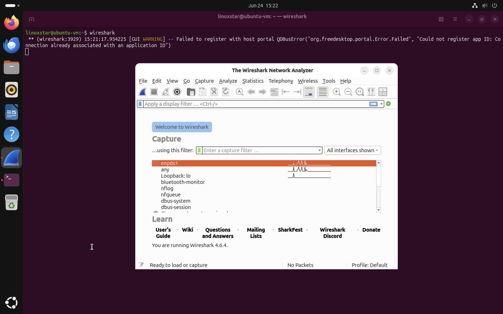

# Lab Setup

## Objective

Prepare an Ubuntu-based laboratory environment for network traffic capture and analysis using Wireshark.


## Lab Environment

| Component               | Configuration |
| ----------------------- | ------------- |
| Host System             | MacBook Pro   |
| Virtualisation Platform | UTM           |
| Guest Operating System  | Ubuntu Linux  |
| Network Analysis Tool   | Wireshark     |
| Network Mode            | NAT           |


## Installing Wireshark

The package repository was updated before installation.

```bash
sudo apt update
```

Wireshark was installed using APT.

```bash
sudo apt install wireshark -y
```

The application was launched using:

```bash
wireshark
```

After installation, Wireshark successfully detected available network interfaces and was ready to begin packet capture.


*Figure 1: Wireshark running on Ubuntu Linux after successful installation.*

## Lab Preparation

The environment was prepared for the following protocol analyses:

* ICMP
* DNS
* TCP
* HTTP
* HTTPS/TLS

Packet captures generated during analysis will be stored within the repository for documentation and review.


