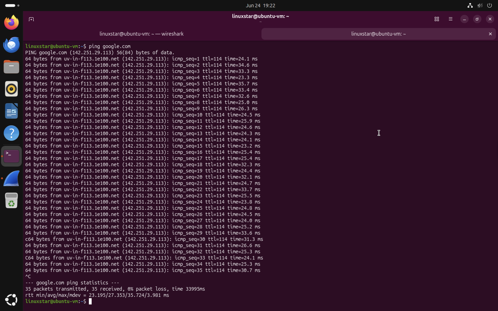

# Packet Capture Basics

Before analysing individual network protocols, it is important to understand the following concepts.

## What is Packet Capture?

Packet capture is the process of intercepting and recording network traffic as it travels across a network interface. Wireshark captures these packets and presents them for detailed analysis. Every packet transmitted across a network contains information such as:

* Source IP address
* Destination IP address
* Protocol type
* Packet size
* Communication details


## Understanding Network Interfaces

A network interface is the connection through which a computer sends and receives network traffic. An easy way to think about this is:

* Computer = House
* Network Interface = Front Door
* Network Packets = People entering and leaving the house

Wireshark listens at one of these "doors" to observe all network traffic passing through it. When Wireshark starts, all available interfaces are displayed. The active interface is usually identified by a small traffic graph showing network activity. Common network interfaces found on Ubuntu include following:

| Interface | Description                                                        |
| --------- | ------------------------------------------------------------------ |
| `eth0`    | Ethernet connection (legacy naming)                                |
| `enp0s3`  | Wired Ethernet interface commonly used in virtual machines         |
| `ens33`   | Ethernet interface used by some virtualisation platforms           |
| `wlan0`   | Wireless (Wi-Fi) interface                                         |
| `lo`      | Loopback interface used for communication within the local machine |

## Starting a Packet Capture

To begin capturing packets:

1. Open Wireshark.
2. Select the active network interface.
3. Double-click the interface.
4. Observe packets appearing in real time.

Once capturing begins, Wireshark continuously records packets until the capture is stopped.


## Understanding the Wireshark Interface

The Wireshark interface consists of three primary sections.

### 1. Packet List Pane

Displays every captured packet in chronological order and following information about packets is included in display,
* Packet number
* Time
* Source
* Destination
* Protocol
* Packet summary

### 2. Packet Details Pane

Displays protocol information for the selected packet.
* Ethernet
* Internet Protocol (IP)
* TCP
* UDP
* DNS
* ICMP
  
### 3. Packet Bytes Pane

Displays the raw packet data in hexadecimal and ASCII format. This allows analysts to inspect the actual bytes transmitted across the network.

## Generating Test Traffic with Ping

To verify that Wireshark is successfully capturing traffic, a simple network test can be performed using the `ping` command. This command checks whether another device on the network is reachable. Running `ping` generates predictable network traffic gives us starting point for learning packet analysis.

```bash
ping google.com
```
When the command does the following:
1. The system resolves `google.com` to an IP address using DNS.
2. An ICMP Echo Request packet is sent to the destination.
3. Google responds with an ICMP Echo Reply.
4. The round-trip time is measured and displayed.



*Figure 1: Executing the `ping google.com` command to generate ICMP network traffic for packet capture.*
## Stopping a Capture

To stop packet collection:

1. Select the **Stop Capture** button.
2. Review the captured traffic.

Captured packets remain available for analysis even after the capture has stopped.
## Saving Packet Captures

Packet captures can be saved for future analysis.

Wireshark uses the following file format:

```text
.pcapng
```

Example:

```text
pcaps/icmp.pcapng
```

Saving captures allows network traffic to be reviewed without generating new packets.


## Screenshot

Insert a screenshot showing:

* Active packet capture
* Packet List Pane
* Packet Details Pane
* Packet Bytes Pane

Example:

```text
screenshots/02-packet-capture-overview.png
```


## Key Observations

* Packet capture records network traffic travelling through a selected network interface.
* Network interfaces act as the communication points between the computer and the network.
* Wireshark displays captured traffic in real time.
* The `ping` command generates ICMP traffic that is easy to identify and analyse.
* Captured traffic can be saved for future investigation using the `.pcapng` file format.


## Conclusion

This exercise introduced the basic concepts required for network traffic analysis using Wireshark. Understanding network interfaces, packet capture, and the generation of test traffic provides the foundation for analysing protocols such as ICMP, DNS, TCP, HTTP, and HTTPS in subsequent sections of this project.

