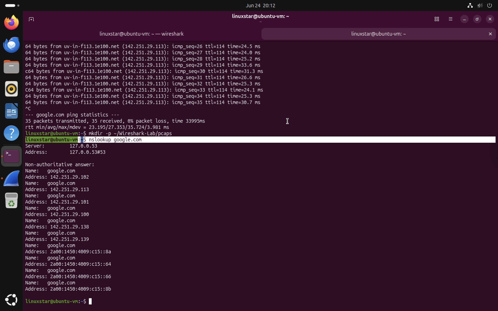
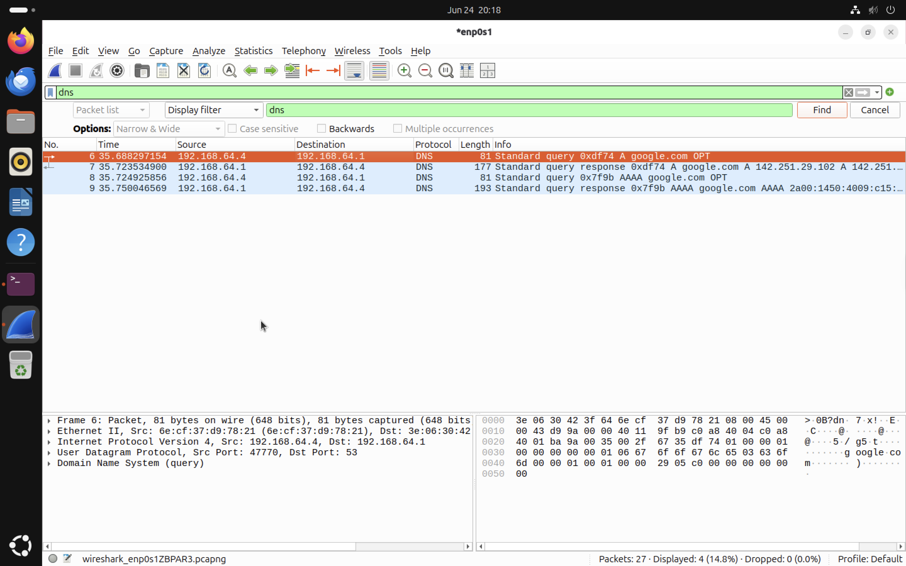

# DNS Analysis

## Objective
DNS stands for Domain Name System. DNS translates human readable domain names into IP addresses. DNS acts like a directory that allows a system to find the IP address associated with a domain name. The objective of this section is to analyse DNS traffic using Wireshark. DNS traffic was generated using the `nslookup` command, captured in Wireshark and filtered using the `dns` display filter.

## Why DNS is Important

DNS is important because most network communication begins with name resolution. Before a system can connect to a domain such as `google.com`, it first determine the IP address of that domain. Without DNS, users would need to remember IP addresses instead of domain names.

In cybersecurity, DNS is also important because it can reveal:

* What domains a system is trying to contact
* Whether a system is communicating with suspicious domains
* Patterns of normal or unusual network behaviour
* Possible command-and-control or malware-related activity in advanced investigations

For this beginner lab, the focus is on understanding normal DNS behaviour.

## Why Capture DNS Packets?
Capturing DNS packets helps analysts understand how systems resolve domain names before communication begins. This provides visibility into the early stage of network communication.

By analysing DNS packets, we can observe:

* The source system making the DNS request
* The DNS server responding to the request
* The queried domain name
* The returned IP address
* Whether IPv4 or IPv6 records are requested

## Generating DNS Traffic

DNS traffic was generated using the following command:

```bash
nslookup google.com
```

The command asks a DNS server to resolve `google.com` into one or more IP addresses.

## Terminal Output



*Figure 1: Running `nslookup google.com` in the Ubuntu terminal to generate DNS traffic.*

The output shows that `google.com` resolved to multiple IP addresses, including IPv4 and IPv6 addresses.
The DNS server shown in the terminal output was:

```text
127.0.0.53
```

This indicates that Ubuntu used its local DNS stub resolver, which then handled the DNS resolution process.

## Capturing DNS Traffic in Wireshark

After starting packet capture in Wireshark, the following display filter was applied, This filter displays only DNS packets and hides unrelated background traffic.

```text
dns
```

## Wireshark DNS Capture



*Figure 2: Wireshark display filter showing DNS queries and responses for `google.com`.*

The capture shows DNS packets between:

```text
192.168.64.4
```

and

```text
192.168.64.1
```

In this lab:

* `192.168.64.4` represents the Ubuntu virtual machine.
* `192.168.64.1` represents the DNS gateway/resolver used by the virtual network.


## DNS Query and Response

The Wireshark capture shows two main types of DNS packets.

### DNS Query

A DNS query is sent when the client asks for the IP address of a domain.

Example from the capture:

```text
Standard query A google.com
```

This means the Ubuntu VM asked for the IPv4 address of `google.com`.

Another query type observed was:

```text
Standard query AAAA google.com
```

This means the Ubuntu VM also asked for the IPv6 address of `google.com`.

### DNS Response

A DNS response is returned by the DNS server and contains the answer to the query.

Example from the capture:

```text
Standard query response A google.com
```

This response contains IPv4 addresses associated with `google.com`.

Another response observed was:

```text
Standard query response AAAA google.com
```

This response contains IPv6 addresses associated with `google.com`.

## DNS Record Types Observed

| Record Type | Meaning                                   |
| ----------- | ----------------------------------------- |
| A           | Resolves a domain name to an IPv4 address |
| AAAA        | Resolves a domain name to an IPv6 address |

Both record types were observed in this lab.
*Why Both IPv4 and IPv6?*

Modern systems often request both IPv4 (A) and IPv6 (AAAA) DNS records. This allows the operating system to use the most appropriate network protocol supported by both the client and the destination server. In this lab, google.com returned both IPv4 and IPv6 addresses because it supports dual-stack networking.

## Key Observations

* DNS traffic was successfully generated using `nslookup google.com`.
* Wireshark captured DNS queries and DNS responses.
* The Ubuntu VM requested both IPv4 and IPv6 records.
* The `dns` display filter made it easier to isolate DNS traffic.
* DNS resolution occurred before any further communication with `google.com`.
* The capture demonstrated how domain names are translated into IP addresses.

## Conclusion

This analysis demonstrated how DNS resolution works at the packet level. The Ubuntu virtual machine sent DNS queries for `google.com`, and the DNS resolver returned multiple IP addresses. Capturing DNS traffic in Wireshark provided visibility into the name resolution process, which is a key stage of normal network communication.

