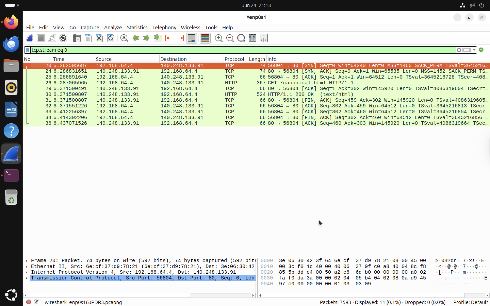

# TCP Three-Way Handshake Analysis

The objective of this exercise is to understand how TCP establishes a reliable connection before any application data is exchanged. Using Wireshark, the TCP three-way handshake was captured and analysed to observe how a client and server initiate, maintain and terminate a network connection.


## What is TCP?

Transmission Control Protocol (TCP) is a connection-oriented transport layer protocol that provides reliable communication between two devices on a network. Unlike connectionless protocols such as UDP, TCP establishes a **connection before transmitting data.** This allows both devices to confirm that they are ready to communicate.

TCP provides several important features:

* Reliable packet delivery
* Ordered packet transmission
* Error detection
* Packet retransmission
* Flow control
* Connection management

Many Internet services rely on TCP, including:

* Web browsing (HTTP/HTTPS)
* Email
* Secure Shell (SSH)
* File Transfer Protocol (FTP)

## Why is a Three-Way Handshake Required?

Before transmitting application data, both the client and server must confirm that they are ready to communicate. This process is known as the **TCP Three-Way Handshake**. Only after the handshake has completed can application protocols such as HTTP or HTTPS begin exchanging data.
The handshake:

* Establishes a reliable connection.
* Synchronises sequence numbers.
* Confirms that both devices can send and receive packets.

## The Three Steps

### Step 1 – SYN

The client initiates communication by sending a **SYN (Synchronize)** packet. This packet informs the server that the client wants to establish a TCP connection.

In this lab:

* Source: Ubuntu Virtual Machine
* Destination: Remote Web Server

### Step 2 – SYN-ACK

The server replies with a **SYN-ACK (Synchronize Acknowledge)** packet. This response confirms:

* The SYN packet was successfully received.
* The server is ready to establish the connection.


### Step 3 – ACK

The client sends an **ACK (Acknowledgement)** packet. This packet completes the handshake.

At this point:

* Both systems trust that communication is possible.
* A reliable TCP connection has been established.

## Generating TCP Traffic

TCP traffic was generated by opening a website in Firefox. The browser automatically initiated a TCP connection before requesting the webpage.

Wireshark captured the entire TCP conversation using the following display filter. The filter isolates a single TCP conversation, making it easier to analyse the connection from beginning to end.

```text
tcp.stream eq 0
```

## TCP Conversation



*Figure 1: A complete TCP conversation showing the three-way handshake, HTTP request, server response, and graceful connection termination.*


## Analysing the Capture

The packet capture demonstrates the complete lifecycle of a TCP connection.

### Packet 20 – SYN

The Ubuntu virtual machine initiated the connection by sending a SYN packet to the remote server. This packet requests permission to establish a TCP session.


### Packet 24 – SYN, ACK

The remote server responded with a SYN-ACK packet. This confirms that the server received the client's request and is prepared to communicate.


### Packet 25 – ACK

The Ubuntu virtual machine acknowledged the server's response by sending an ACK packet. This completes the TCP three-way handshake. At this stage, the TCP connection has been successfully established.

### Packet 26 – HTTP GET Request

Immediately after the handshake, Firefox sent an HTTP GET request. This demonstrates an important concept that **Application data is transmitted only after the TCP connection has been established.**

### Packet 30 – HTTP 200 OK

The web server responded with an **HTTP/1.1 200 OK** message. This indicates that the requested resource was successfully located and returned to the client.


### Packets 31–36 – Connection Termination

Once the data exchange was complete, both systems closed the connection using **FIN** and **ACK** packets. This process is known as a **graceful connection termination**, ensuring that both devices have completed all outstanding communication before disconnecting.


## Relationship Between TCP and HTTP

The packet capture demonstrates the dependency between TCP and HTTP.

The communication sequence observed during the lab was:
```text


Client (Ubuntu VM)                 Server

SYN        ---------------------->

           <---------------------- SYN, ACK

ACK        ---------------------->

Connection Established

HTTP GET   ---------------------->

           <---------------------- HTTP 200 OK

FIN        ---------------------->

           <---------------------- ACK
```

HTTP does not create network connections itself. Instead, HTTP relies on TCP to provide a reliable transport channel before application data is exchanged.

## Key Observations

* TCP established a reliable connection before transmitting application data.
* The connection followed the standard three-way handshake:

  * SYN
  * SYN-ACK
  * ACK
* The HTTP request was sent only after the handshake completed.
* The server returned an HTTP 200 OK response.
* The TCP connection was closed gracefully using FIN and ACK packets.
* Wireshark's `tcp.stream` filter made it possible to analyse an individual TCP conversation from start to finish.


## Conclusion

This analysis demonstrated how TCP establishes reliable communication between a client and server. The three-way handshake ensures that both devices are ready to exchange data before application protocols such as HTTP begin transmitting information. By isolating a single TCP conversation in Wireshark, the complete connection lifecycle from establishment to termination could be observed and analysed.

