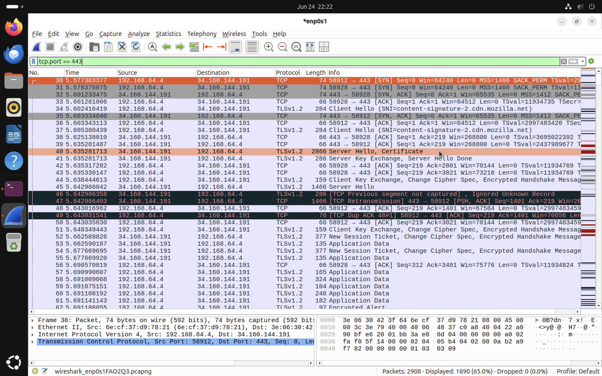

# TLS Handshake Analysis

## Objective

The objective of this exercise is to analyse the TLS (Transport Layer Security) handshake using Wireshark. The capture demonstrates how a client and server negotiate a secure connection before exchanging encrypted application data.

---

## How a Secure Connection is Established

When a user visits a secure website such as `https://google.com`, several networking protocols work together. Each protocol performs a specific task before the webpage can be displayed securely.

```text
User enters https://google.com
           │
           ▼
DNS
Resolve the domain name to an IP address
           │
           ▼
TCP Three-Way Handshake
Establish a reliable connection
           │
           ▼
TLS Handshake
Negotiate encryption and authenticate the server
           │
           ▼
HTTPS Request
Request the webpage securely
           │
           ▼
HTTPS Response
Receive the encrypted webpage
```

The previous chapter analysed the TCP Three-Way Handshake. This chapter continues the communication process by examining how TLS establishes a secure and encrypted session.

---

## What is TLS?

Transport Layer Security (TLS) is a cryptographic protocol that provides secure communication over a network.

TLS ensures that communication between a client and server is:

* Confidential through encryption
* Authentic through digital certificates
* Protected against data modification through integrity checks

Today, TLS is used by HTTPS, secure email protocols, VPNs, and many other Internet services.

---

## Why is TLS Required?

A TCP connection only guarantees reliable delivery of data. It does **not** encrypt the information being transmitted.

Without TLS:

* Usernames and passwords could be intercepted.
* Sensitive information could be read by attackers.
* Data could potentially be modified during transmission.

TLS solves these problems by establishing encrypted communication after the TCP connection has been created.

---

## Relationship Between TCP and TLS

TCP and TLS perform different roles.

```text
TCP
Establishes a reliable connection
          │
          ▼
TLS
Negotiates encryption and authenticates the server
          │
          ▼
HTTPS
Transfers encrypted web traffic
```

TLS depends on TCP. The TLS handshake cannot begin until the TCP Three-Way Handshake has successfully completed.

---

## Generating TLS Traffic

TLS traffic was generated by visiting a secure website in Firefox.

The packet capture was filtered using:

```text
tcp.port == 443
```

Port **443** is the standard port used for HTTPS traffic.

Using this filter allows both the TCP connection and the subsequent TLS handshake to be observed within the same conversation.

---

## TLS Handshake Capture



*Figure 1: Wireshark capture showing the transition from TCP connection establishment to the TLS handshake and encrypted HTTPS communication.*

---

## Analysing the TLS Handshake

The packet capture demonstrates the sequence of events required to establish secure communication.

### TCP Connection

The communication begins with the TCP Three-Way Handshake.

This establishes a reliable transport channel between the client and the remote server.

Only after TCP has successfully established the connection does the TLS handshake begin.

---

### Client Hello

The client initiates the TLS handshake by sending a **Client Hello** message.

The Client Hello contains information such as:

* Supported TLS versions
* Supported cipher suites
* Random values used during key generation
* Server Name Indication (SNI)

The SNI extension identifies the hostname the client wishes to access.

---

### Server Hello

The server responds with a **Server Hello** message.

This message selects:

* The TLS version
* The cipher suite
* Cryptographic parameters used during the session

This response indicates that the server is willing to establish a secure connection.

---

### Digital Certificate

The server then sends its digital certificate.

The certificate allows the client to:

* Verify the server's identity
* Confirm that the certificate was issued by a trusted Certificate Authority (CA)
* Reduce the risk of communicating with an impersonated server

This authentication process is one of the key security features provided by TLS.

---

### Client Key Exchange

After validating the certificate, the client sends a **Client Key Exchange** message.

This exchange allows both the client and server to derive a shared session key.

The session key is used for encrypting all subsequent communication.

---

### Change Cipher Spec

Both devices exchange **Change Cipher Spec** messages.

These messages indicate that future communication will use the negotiated encryption settings.

---

### Encrypted Handshake Message

Once encryption has been enabled, the remaining handshake messages are transmitted in encrypted form.

This confirms that both systems have successfully negotiated the secure session.

---

### Encrypted Application Data

After the TLS handshake is complete, the client and server begin exchanging encrypted application data.

At this stage:

* The webpage request is encrypted.
* The webpage response is encrypted.
* Wireshark can observe the packets but cannot read their contents without the appropriate session keys.

---

## What Wireshark Can and Cannot See

Wireshark provides visibility into the TLS handshake because these messages are required to establish secure communication.

However, after encryption has been enabled:

Wireshark **can** observe:

* Client Hello
* Server Hello
* Certificate exchange
* Change Cipher Spec
* Packet sizes
* Source and destination addresses

Wireshark **cannot** normally observe:

* Usernames
* Passwords
* Webpage contents
* Form submissions
* Other encrypted application data

This demonstrates the effectiveness of TLS in protecting sensitive information.

---

## Key Observations

* TLS operates after the TCP connection has been established.
* The Client Hello initiated the TLS negotiation.
* The server responded with a Server Hello and digital certificate.
* Both systems negotiated a shared session key.
* Encryption was enabled using the Change Cipher Spec messages.
* Subsequent HTTPS communication appeared as encrypted application data.
* Filtering on `tcp.port == 443` allowed both the TCP connection and TLS handshake to be analysed together.

---

## Conclusion

This analysis demonstrated how TLS establishes secure communication following the TCP Three-Way Handshake. By negotiating encryption parameters, authenticating the server, and creating a shared session key, TLS protects the confidentiality and integrity of web traffic. The Wireshark capture illustrates the transition from an unencrypted TCP connection to encrypted HTTPS communication, highlighting the role of TLS in securing modern Internet communications.

