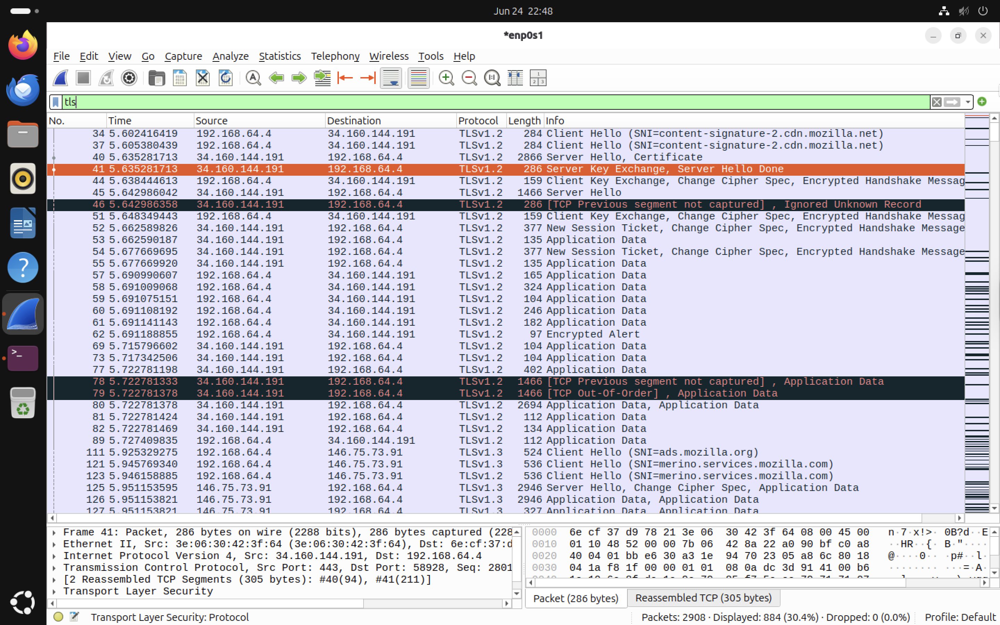

# TLS Handshake Analysis

The objective of this exercise is to analyse the TLS (Transport Layer Security) handshake using Wireshark. The capture demonstrates how a client and server negotiate a secure connection before exchanging encrypted application data.

## How a Secure Connection is Established

When we visits a secure website such as `https://google.com`, several networking protocols work together. Each protocol performs a specific task before the webpage can be displayed securely. The previous chapter analysed the TCP Three-Way Handshake. This chapter continues the communication process by examining how TLS establishes a secure and encrypted session.

```text
User enters https://google.com
           │
           ▼
DNS
Resolve the domain name to an IP address
           │
           ▼
TCP Three-Way Handshake
Establish a reliable connection
           │
           ▼
TLS Handshake
Negotiate encryption and authenticate the server
           │
           ▼
HTTPS Request
Request the webpage securely
           │
           ▼
HTTPS Response
Receive the encrypted webpage
```
## What is TLS?

Transport Layer Security (TLS) is a cryptographic protocol that provides secure communication over a network. Today TLS is used by HTTPS, secure email protocols, VPNs and many other Internet services. TLS ensures that communication between a client and server is:
* Confidential through encryption
* Authentic through digital certificates
* Protected against data modification through integrity checks
  
## Why is TLS Required?

A TCP connection only guarantees reliable delivery of data. It does **not** encrypt the information being transmitted. TLS solves these problems by establishing encrypted communication after the TCP connection has been created.
Without TLS:
* Usernames and passwords could be intercepted.
* Sensitive information could be read by attackers.
* Data could potentially be modified during transmission.

## Relationship Between TCP and TLS

TCP and TLS perform different roles.

```text
TCP
Establishes a reliable connection
          │
          ▼
TLS
Negotiates encryption and authenticates the server
          │
          ▼
HTTPS
Transfers encrypted web traffic
```

TLS depends on TCP. The **TLS handshake cannot begin until the TCP Three-Way Handshake has successfully completed.**

## Generating TLS Traffic

TLS traffic was generated by visiting a secure website in Firefox.

The packet capture was filtered using:

```text
tcp.port == 443
```

Port **443** is the standard port used for HTTPS traffic.

Using this filter allows both the TCP connection and the subsequent TLS handshake to be observed within the same conversation.

## TLS Handshake Capture


*Figure 1: Wireshark capture showing the transition from TCP connection establishment to the TLS handshake and encrypted HTTPS communication.*

# TLS Handshake Analysis
Unlike TCP, which always consists of **three packets**, the TLS handshake contains multiple messages.
The exact sequence depends on TLS version, cipher suite, key exchange algorithm and session resumption
The capture analysed in this lab primarily demonstrates a **TLS 1.2** handshake.
### TLS 1.2 vs TLS 1.3
The packet capture in this lab primarily demonstrates **TLS 1.2**, although modern browsers also establish **TLS 1.3** connections where supported. TLS 1.3 reduces latency and improves security by simplifying the handshake and encrypting more of the negotiation process.

| TLS 1.2                                     | TLS 1.3                           |
| ------------------------------------------- | --------------------------------- |
| More handshake messages                     | Fewer handshake messages          |
| Slower connection establishment             | Faster connection establishment   |
| Separate Server Key Exchange message        | Simplified key exchange           |
| More visible handshake packets in Wireshark | More encrypted handshake messages |
| Still widely supported                      | Recommended modern standard       |


# TLS Handshake Phases

TLS handshake can be understood as three logical phases.



*Figure 2: TLS handshake captured in Wireshark using the **`tls`** display filter. The capture shows the transition from identity verification to key negotiation and finally encrypted application data.*

## Phase 1 — Identity Verification

The purpose of this phase is to identify the server and agree on how secure communication will occur.

Packets observed:

```text
Client Hello

↓

Server Hello

↓

Certificate
```

### Client Hello

The client initiates the TLS handshake by sending:
* Supported TLS versions
* Supported cipher suites
* Random values
* Server Name Indication (SNI)
Example observed in Wireshark:

```text
Client Hello
(SNI=content-signature-2.cdn.mozilla.net)
```
### Server Hello

The server selects:
* TLS version
* Cipher suite
* Cryptographic algorithms
and sends them back to the client.

### Certificate

The server presents its digital certificate.
The client validates:
* Server identity
* Certificate Authority (CA)
* Certificate validity
This prevents clients from **unknowingly communicating with malicious servers.**

## Phase 2 — Key Negotiation

Once the server has been authenticated, both systems negotiate a shared secret that will be used for encryption.
Packets observed:
```text
Server Key Exchange

↓

Server Hello Done

↓

Client Key Exchange
```

### Server Key Exchange

The server sends cryptographic information required for generating the shared session key.

### Server Hello Done

This message indicates that the server has completed its part of the negotiation.

### Client Key Exchange

The client sends information that allows both devices to derive the same session key independently. The session key itself is never transmitted across the network.

## Phase 3 — Secure Communication

Once both systems possess the same session key, encrypted communication begins.

Packets observed:

```text
Change Cipher Spec

↓

Encrypted Handshake Message

↓

Application Data
```
### Change Cipher Spec

Both systems notify each other that all future communication will use the negotiated encryption settings.

### Encrypted Handshake Message

The remaining handshake messages are transmitted in encrypted form. This confirms that both systems successfully negotiated identical encryption parameters.

### Application Data

Once the handshake completes, all web traffic becomes encrypted. Wireshark can still observe:
* Source IP
* Destination IP
* Packet sizes
* Timing information
However the webpage contents remain encrypted.

# What Can Wireshark See?

Before encryption begins, Wireshark can observe:

* Client Hello
* Server Hello
* Certificate
* Key Exchange
* Change Cipher Spec

After encryption begins, Wireshark normally cannot read:

* Usernames
* Passwords
* Webpage contents
* Form submissions
* Sensitive application data

Instead, encrypted packets simply appear as:

```text
Application Data
```
This demonstrates the effectiveness of TLS encryption.


# Key Observations

* TLS begins only after TCP successfully establishes a connection.
* The handshake authenticates the server using digital certificates.
* A shared session key is negotiated without transmitting the key itself.
* Encryption begins after the Change Cipher Spec messages.
* All subsequent HTTPS communication appears as encrypted application data.
* The capture demonstrates the major phases of a TLS 1.2 handshake while also illustrating concepts that remain relevant to TLS 1.3.


# Conclusion

This analysis demonstrated how TLS transforms a reliable TCP connection into a secure HTTPS session. By authenticating the server, negotiating cryptographic parameters, and establishing a shared session key, TLS protects the confidentiality and integrity of modern web communications. Organising the handshake into three logical phases—Identity Verification, Key Negotiation, and Secure Communication—provides a clearer understanding of how encrypted connections are established than simply memorising individual packet names.

