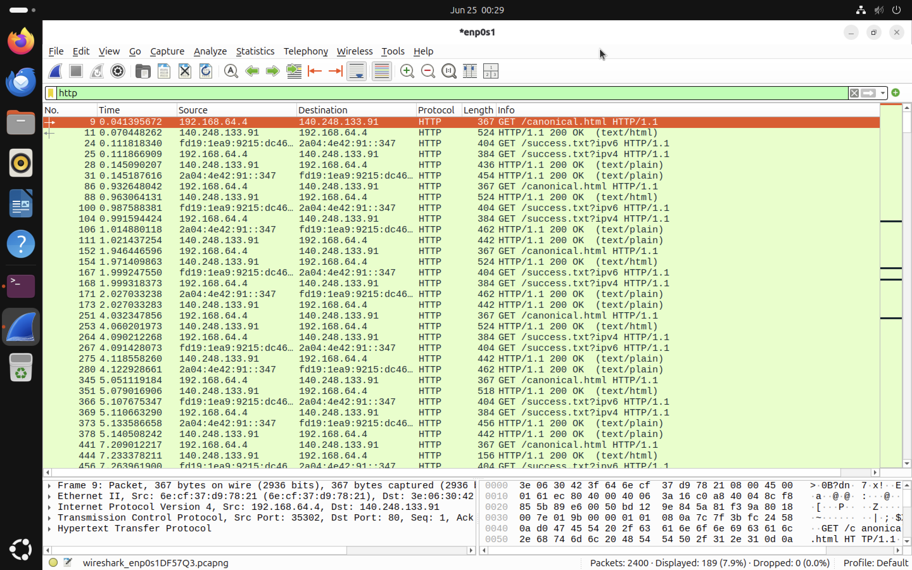
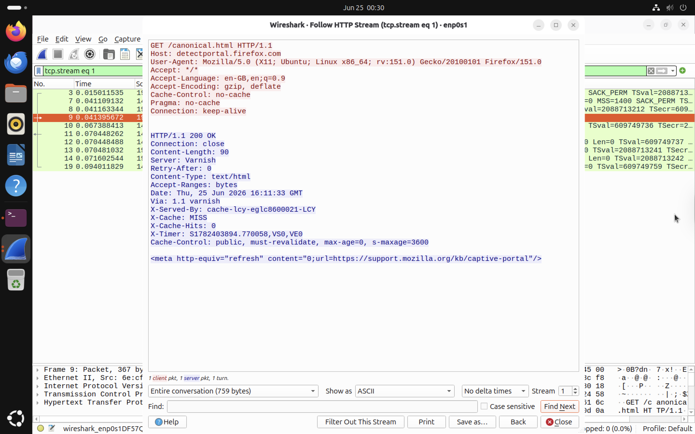
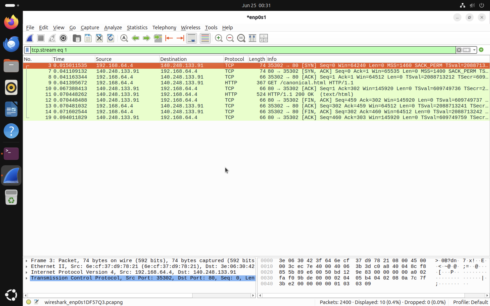
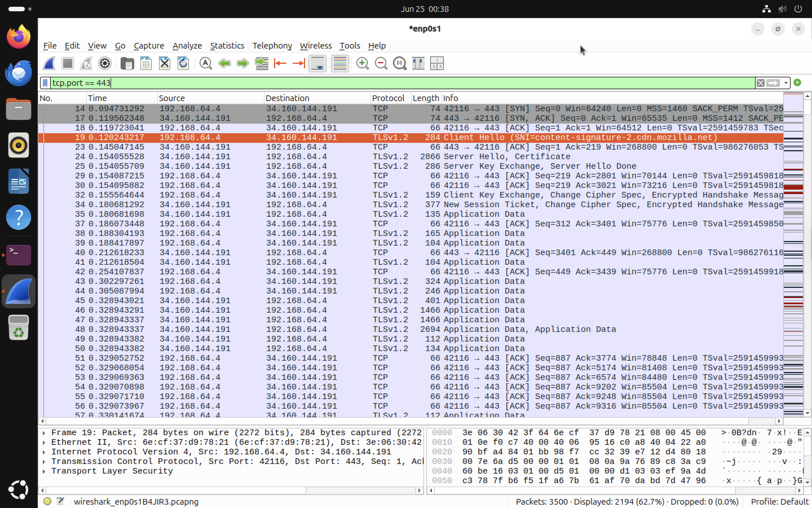
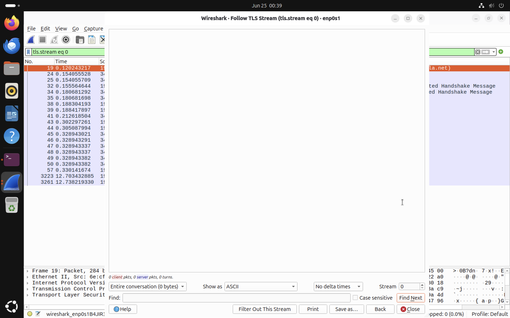
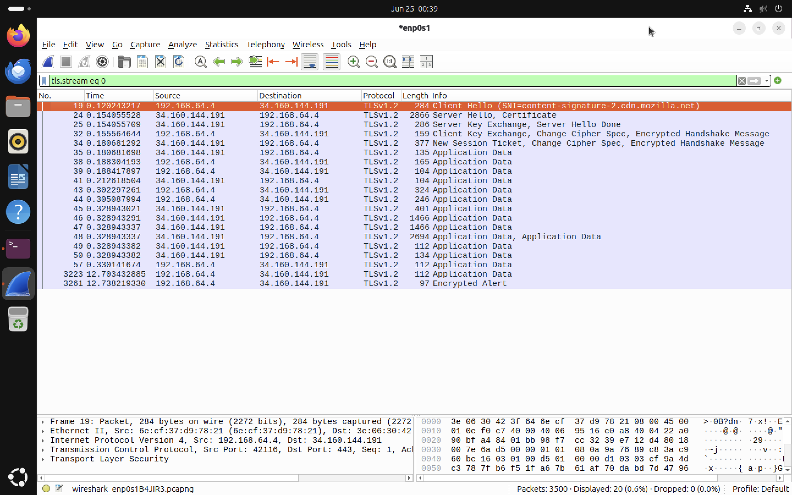

# HTTP and HTTPS Traffic Analysis

The objective of this lab is to compare **HTTP** and **HTTPS** traffic using Wireshark. By capturing and analyzing both protocols, we can understand how web communication changes when encryption is introduced through Transport Layer Security (TLS). This comparison demonstrates why modern websites use HTTPS instead of HTTP and how Wireshark can be used to analyze both encrypted and unencrypted network traffic.

# HTTP Protocol Analysis

## What is HTTP?

**Hypertext Transfer Protocol (HTTP)** is the application layer protocol used to transfer web pages between a client (web browser) and a web server.

HTTP operates over:

- TCP
- Default Port: **80**
Unlike HTTPS, HTTP does **not encrypt** any transmitted data. Every request and response is sent in plain text, making it readable by anyone capable of capturing the network traffic.

## Capturing HTTP Traffic

To generate HTTP traffic, an HTTP website was accessed using Firefox while Wireshark captured all network packets.
Display Filter used:

```text
http
```


**Figure 9:** HTTP packets captured using the `http` display filter.

The capture shows multiple HTTP GET requests and HTTP responses exchanged between the client and the web server.
Several observations can be made:
- HTTP requests are sent over TCP Port 80.
- The requested resource is clearly visible.
- HTTP response codes are visible.
- Both request and response contents are transmitted without encryption.

For example:

```
GET /canonical.html HTTP/1.1
```
followed by
```
HTTP/1.1 200 OK
```
This indicates that the server successfully processed the request and returned the requested resource.

## Following the HTTP Stream

One of Wireshark's most useful features is **Follow HTTP Stream**, which reconstructs the entire application layer conversation between the client and server.

Filter used:

```text
tcp.stream eq 1
```

Then:

```
Right Click Packet
→ Follow
→ HTTP Stream
```


**Figure 10:** Complete HTTP conversation reconstructed using Wireshark.

The reconstructed stream reveals the complete communication between the client and the web server.

The request contains information such as:

- HTTP Method
- Requested Resource
- Host
- User-Agent
- Accepted Languages
- Accepted Encoding
- Cache Settings
Example:

```http
GET /canonical.html HTTP/1.1
Host: detectportal.firefox.com
User-Agent: Mozilla Firefox
```
The server response is also completely visible:

```http
HTTP/1.1 200 OK
```

including:

- Status Code
- Server Software
- Content Type
- Cache Information
- HTML Response

Since HTTP does not encrypt traffic every header and response can be inspected directly within Wireshark.

## HTTP Conversation

The complete TCP conversation associated with the HTTP request can also be isolated.

Display Filter:

```text
tcp.stream eq 1
```


**Figure 11:** TCP conversation corresponding to the captured HTTP request.

The conversation shows the complete lifecycle of the HTTP communication:

1. TCP Three-Way Handshake
2. HTTP GET Request
3. HTTP Response (200 OK)
4. Connection Termination

This demonstrates that HTTP depends on TCP to provide reliable communication but performs no encryption itself.

# HTTPS Protocol Analysis

## What is HTTPS?
**Hypertext Transfer Protocol Secure (HTTPS)** is the secure version of HTTP. HTTPS combines TCP, TLS (Transport Layer Security) and HTTP. Instead of sending web data directly over TCP, HTTPS first establishes a secure TLS session before any HTTP data is exchanged. Default Port is 443. The communication flow is following that prevents attackers from reading or modifying transmitted data.

```
Client
      │
      ▼
TCP Handshake
      │
      ▼
TLS Handshake
      │
      ▼
Encrypted HTTP Communication
```

## Capturing HTTPS Traffic

To observe HTTPS traffic, a secure website was opened in Firefox (www.google.com) while Wireshark captured the packets.

Display Filter:

```text
tcp.port == 443
```


**Figure 12:** HTTPS traffic captured over TCP Port 443.

Unlike HTTP traffic, the capture immediately shows TLS packets instead of readable HTTP messages.
The capture contains:
- TCP Handshake
- TLS Client Hello
- TLS Server Hello
- Certificate Exchange
- Key Exchange
- Encrypted Application Data

Notice that no readable HTTP request appears in the packet list. Instead, Wireshark displays entries such as:

```
TLSv1.2 Client Hello
```

```
Server Hello
```

```
Application Data
```

This indicates that the application data is protected by TLS encryption.

## Following the TLS Stream

Wireshark also allows following the TLS stream.

Filter:

```text
tls.stream eq 0
```

Then:

```
Right Click Packet
→ Follow
→ TLS Stream
```



**Figure 13:** Following the TLS stream.

Unlike HTTP, the TLS stream does not reveal readable application data. The window appears empty because the HTTP request and response have already been encrypted before transmission. Without the session encryption keys, Wireshark cannot decrypt the protected communication. This demonstrates one of HTTPS's primary security advantages:
- Requests remain confidential.
- Responses remain confidential.
- Sensitive information cannot be viewed by passive network observers.


## HTTPS Conversation

The entire HTTPS conversation can also be isolated.

Display Filter:

```text
tls.stream eq 0
```


**Figure 14:** Complete HTTPS communication showing the TLS handshake followed by encrypted application data.

The captured conversation illustrates the typical HTTPS workflow:

1. TCP Three-Way Handshake
2. TLS Client Hello
3. TLS Server Hello
4. Certificate Exchange
5. Key Exchange
6. Encrypted Application Data
7. Encrypted Alert

Unlike HTTP, no readable webpage content is visible after the TLS handshake because the remaining communication is encrypted.


# HTTP vs HTTPS Comparison

| Feature | HTTP | HTTPS |
|----------|-------|--------|
| Default Port | 80 | 443 |
| Encryption | No |  Yes (TLS) |
| Data Visibility | Fully readable | Encrypted |
| Authentication | No | Certificate based |
| Confidentiality | None | High |
| Packet Inspection | Complete application data visible | Only handshake metadata visible |
| Typical Usage | Testing, internal networks | Modern websites, online services |


# Key Observations

From this analysis several important differences were observed:

- HTTP transmits requests and responses in plain text.
- Wireshark can reconstruct complete HTTP conversations.
- HTTPS introduces a TLS handshake before application data is exchanged.
- After the TLS handshake, application data becomes encrypted.
- Wireshark can observe the handshake process but cannot read encrypted webpage content without the necessary session keys.

This comparison clearly demonstrates why HTTPS has become the standard protocol for secure communication on the modern Internet.
