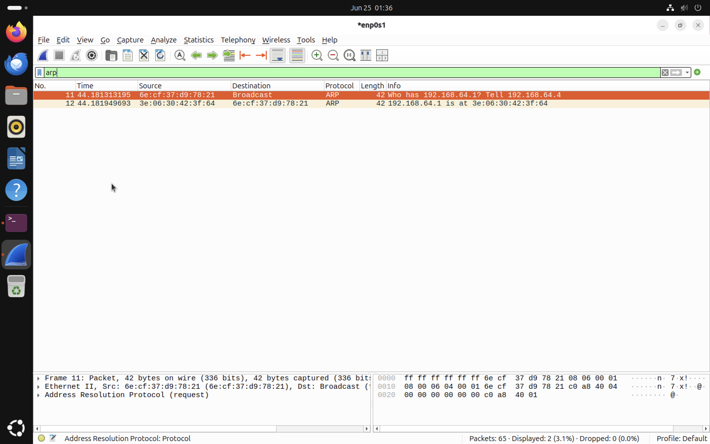
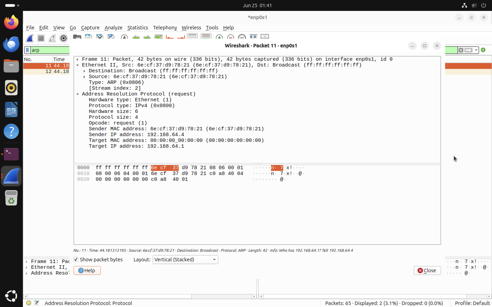
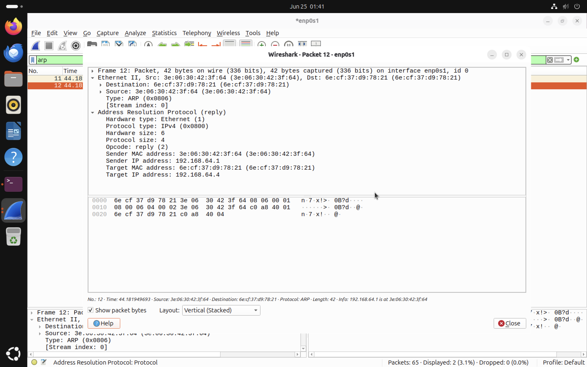

# ARP Analysis

The objective of this lab is to analyse Address Resolution Protocol (ARP) traffic using Wireshark. This demonstrates how a device discovers the MAC address associated with an IP address before local network communication can occur.

## What is ARP?

ARP stands for **Address Resolution Protocol**. It is used to map an IPv4 address to a MAC address on a local network. A device may know the destination IP address, but Ethernet communication requires a MAC address. ARP solves this problem by asking:

```text
Who has this IP address?
```
The device that owns the IP address replies with its MAC address.

## Why ARP is Important

ARP is important because IP addresses and MAC addresses serve different purposes.

| Address Type | Purpose                                                         |
| ------------ | --------------------------------------------------------------- |
| IP Address   | Identifies a device at the network layer                        |
| MAC Address  | Identifies a device on the local network at the data-link layer |

Before a packet can be delivered on a local network, the sender must know the destination MAC address. For example, if the Ubuntu virtual machine wants to communicate with the gateway:

```text
192.168.64.1
```
it must first discover the MAC address associated with that IP address.
## ARP in the Communication Flow

ARP happens before higher-level communication such as TCP, TLS, HTTP, or HTTPS.

```text
User accesses a website
        │
        ▼
DNS resolves the domain name
        │
        ▼
ARP discovers the local gateway MAC address
        │
        ▼
TCP establishes a reliable connection
        │
        ▼
TLS secures the connection
        │
        ▼
HTTPS transfers encrypted web traffic
```

This makes ARP an **important part of normal network behaviour.**

## Generating ARP Traffic

To generate ARP traffic, the ARP cache was cleared and a ping was sent to the local gateway.

```bash
sudo ip neigh flush all
```
Then:

```bash
ping 192.168.64.1
```

## Wireshark Filter Used

The following display filter was used to isolate ARP traffic:

```text
arp
```



*Figure 15: ARP request and reply captured using the `arp` display filter.*

The capture shows a complete ARP exchange consisting of two packets:

| Packet      | Description                               |
| ----------- | ----------------------------------------- |
| ARP Request | The Ubuntu VM asks who has `192.168.64.1` |
| ARP Reply   | The gateway replies with its MAC address  |


## ARP Request Analysis



*Figure 16: ARP request packet details.*

The ARP request asks:

```text
Who has 192.168.64.1? Tell 192.168.64.4
```
Observed fields:

| Field                | Value               |
| -------------------- | ------------------- |
| Opcode               | Request             |
| Sender MAC Address   | `6e:cf:37:d9:78:21` |
| Sender IP Address    | `192.168.64.4`      |
| Target MAC Address   | `00:00:00:00:00:00` |
| Target IP Address    | `192.168.64.1`      |
| Ethernet Destination | Broadcast           |

The destination MAC address is:

```text
ff:ff:ff:ff:ff:ff
```

This means the ARP request was broadcast to all devices on the local network. The target MAC address is all zeros because the sender does not yet know which MAC address belongs to `192.168.64.1`.

## ARP Reply Analysis



*Figure 17: ARP reply packet details.*

The ARP reply provides the answer:

```text
192.168.64.1 is at 3e:06:30:42:3f:64
```
Observed fields:

| Field                | Value                 |
| -------------------- | --------------------- |
| Opcode               | Reply                 |
| Sender MAC Address   | `3e:06:30:42:3f:64`   |
| Sender IP Address    | `192.168.64.1`        |
| Target MAC Address   | `6e:cf:37:d9:78:21`   |
| Target IP Address    | `192.168.64.4`        |
| Ethernet Destination | Ubuntu VM MAC address |

Unlike the ARP request, the ARP reply is sent directly to the requesting device. This is known as **unicast** communication.

## Broadcast vs Unicast

ARP demonstrates both broadcast and unicast communication. The ARP request must be broadcast because the sender does not yet know the destination MAC address. The ARP reply can be unicast because the responding device knows the sender's MAC address from the original request.

| Packet Type | Communication Type | Explanation                                 |
| ----------- | ------------------ | ------------------------------------------- |
| ARP Request | Broadcast          | Sent to all devices on the local network    |
| ARP Reply   | Unicast            | Sent directly back to the requesting device |


## ARP Cache

After receiving the ARP reply, the system stores the IP-to-MAC mapping in its ARP cache. This prevents the system from sending a new ARP request every time it needs to communicate with the same device. The ARP cache can be viewed using:

```bash
ip neigh
```

## Security Considerations

ARP does not include authentication. This means a malicious device on the same local network could send false ARP replies and claim to own another IP address. This attack is known as **ARP spoofing or ARP poisoning** ARP spoofing can be used in man-in-the-middle attacks, where an attacker intercepts traffic between two devices. Although this lab focuses on normal ARP behaviour, understanding ARP is important for recognising suspicious network activity.

## Key Observations

* ARP maps IPv4 addresses to MAC addresses on a local network.
* The ARP request was sent as a broadcast frame.
* The ARP reply was sent as a unicast frame.
* The Ubuntu VM asked for the MAC address of `192.168.64.1`.
* The gateway responded with its MAC address.
* ARP occurs before TCP, TLS, HTTP, and HTTPS communication.
* ARP is essential for local network communication but has security limitations.

## Conclusion

This lab demonstrated how ARP enables local network communication by resolving IPv4 addresses to MAC addresses. The Wireshark capture showed a complete ARP exchange, beginning with a broadcast request and ending with a unicast reply. Understanding ARP is important for analysing normal network behaviour and recognising potential local network attacks such as ARP spoofing.

