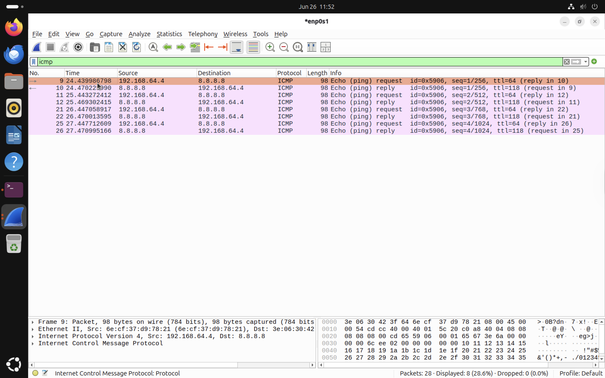
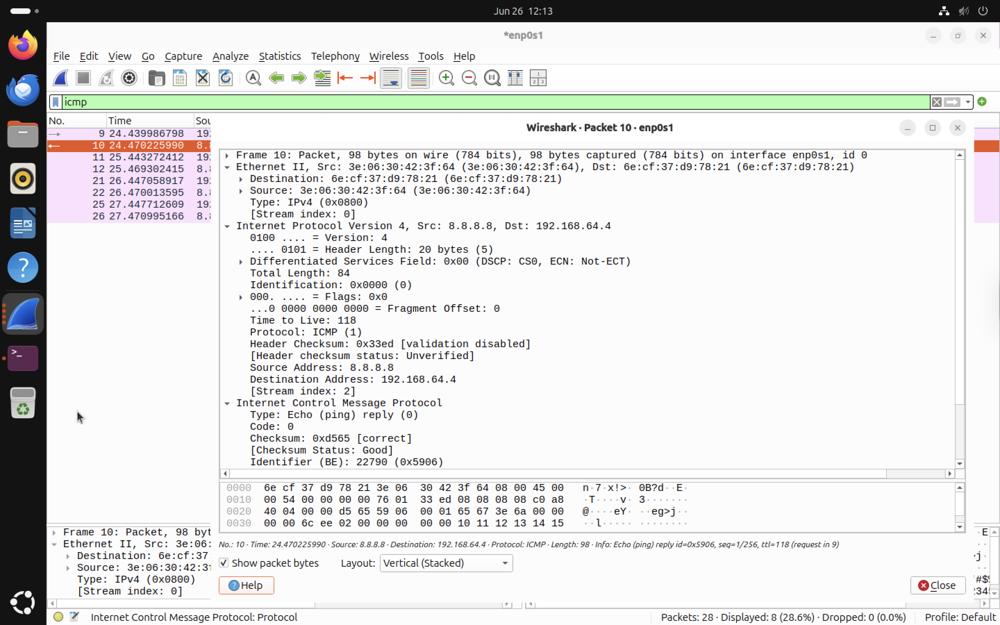
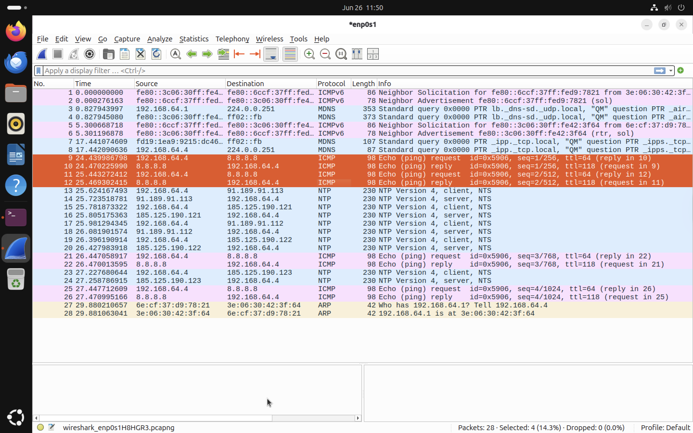

# 08 – ICMP (Internet Control Message Protocol) Analysis

The Internet Control Message Protocol (ICMP) is a network layer protocol used for diagnostics, error reporting and connectivity testing. Unlike TCP and UDP, ICMP does not transport application data. Instead, it allows network devices to verify whether another host is reachable and helps **identify network problems.** The most common ICMP utility is the `ping` command, which sends **Echo Request** messages and waits for **Echo Reply** messages from the destination.
# Objectives

During this lab I aimed to:

* Generate ICMP traffic using the `ping` command.
* Capture ICMP packets with Wireshark.
* Analyse Echo Request and Echo Reply messages.
* Examine important ICMP fields such as Identifier, Sequence Number, and Time To Live (TTL).
* Understand how ICMP supports network diagnostics.

# Lab Environment

| Component        | Details             |
| ---------------- | ------------------- |
| Operating System | Ubuntu Linux        |
| Analysis Tool    | Wireshark           |
| Protocol         | ICMP                |
| Test Command     | `ping 8.8.8.8 -c 4` |


# Generating ICMP Traffic

ICMP traffic was generated using the following command, this command sends four ICMP Echo Request packets to Google's public DNS server (8.8.8.8). Each request expects an Echo Reply from the destination.


```bash
ping 8.8.8.8 -c 4
```

# Wireshark Display Filter

The following display filter was applied:

```text
icmp
```


# ICMP Conversation



The capture shows four Echo Requests followed by four Echo Replies exchanged between the Ubuntu virtual machine and Google's public DNS server. Each request has a corresponding reply, confirming successful communication between both hosts.


# Echo Request Analysis


The Echo Request packet is transmitted from the local machine to the destination host. The Echo Request asks the destination host whether it is reachable. In this capture,
* Source IP Address: **192.168.64.4**
* Destination IP Address: **8.8.8.8**
* ICMP Message Type: **Echo Request**
* TTL: **64**


# Echo Reply Analysis



The destination host responds with an Echo Reply after successfully receiving the request. This confirms successful communication with the destination. The source and destination addresses are reversed compared to the Echo Request. In this capture,
* Source IP Address: **8.8.8.8**
* Destination IP Address: **192.168.64.4**
* ICMP Message Type: **Echo Reply**
* TTL: **118**

# Request and Reply Relationship



Each Echo Request has a matching Echo Reply. Matching sequence numbers confirm that each transmitted packet was successfully returned by the destination.

| Echo Request | Echo Reply |
| ------------ | ---------- |
| Sequence 1   | Sequence 1 |
| Sequence 2   | Sequence 2 |
| Sequence 3   | Sequence 3 |
| Sequence 4   | Sequence 4 |

# Important ICMP Fields

## Identifier

The Identifier uniquely associates Echo Replies with the Echo Requests generated by the same process.mThis allows the operating system to correctly match incoming replies with the requests that were originally sent.

## Sequence Number

The Sequence Number increments for every Echo Request. If a reply is missing, the sequence number helps identify packet loss.

Example:

```
Echo Request 1
        ↓
Echo Reply 1

Echo Request 2
        ↓
Echo Reply 2

Echo Request 3
        ↓
Echo Reply 3

Echo Request 4
        ↓
Echo Reply 4
```

## Time To Live (TTL)

TTL limits the maximum number of network hops that an IP packet can travel. Each router decreases the TTL value by one before forwarding the packet.

Example:

```
TTL = 64

↓

63

↓

62

↓

61
```

If TTL reaches zero, the packet is discarded to prevent routing loops.

In this capture:

* Echo Requests were transmitted with a TTL value of **64**.
* Echo Replies returned with a TTL value of **118**, reflecting the remote host's operating system default TTL and the number of routers traversed.

# Common ICMP Message Types

| Type | Description             |
| ---- | ----------------------- |
| 0    | Echo Reply              |
| 3    | Destination Unreachable |
| 5    | Redirect                |
| 8    | Echo Request            |
| 11   | Time Exceeded           |

These message types are commonly encountered during network troubleshooting and diagnostics.


# Security Perspective

Although ICMP is designed for diagnostics, it is frequently used during reconnaissance activities by attackers for host discovery, ping sweeps, network mapping and avaliability testing. Security monitoring tools often analyse ICMP traffic to detect unusual scanning activity or excessive probing across a network.

# Key Findings

* Successfully generated ICMP traffic using the `ping` command.
* Captured both Echo Requests and Echo Replies in Wireshark.
* Verified successful communication with Google's public DNS server.
* Analysed important ICMP fields including Identifier, Sequence Number, and TTL.
* Observed how ICMP enables connectivity testing without transporting application layer data.

# Conclusion

This lab demonstrated how ICMP enables devices to verify network connectivity by exchanging Echo Request and Echo Reply messages. Through packet analysis in Wireshark, it was possible to observe packet flow, analyse important protocol fields, and understand how ICMP supports troubleshooting and network diagnostics. Although ICMP does not carry user application data, it remains an essential protocol for network administration and cybersecurity investigations.

