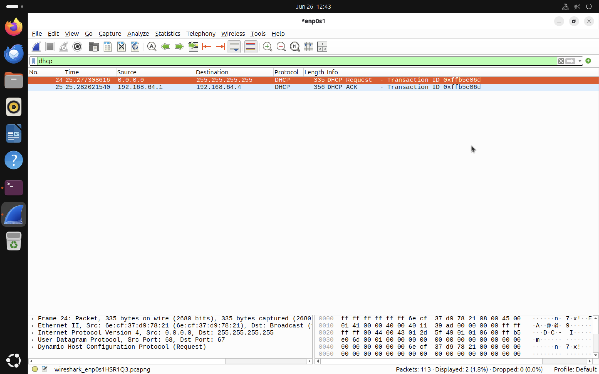
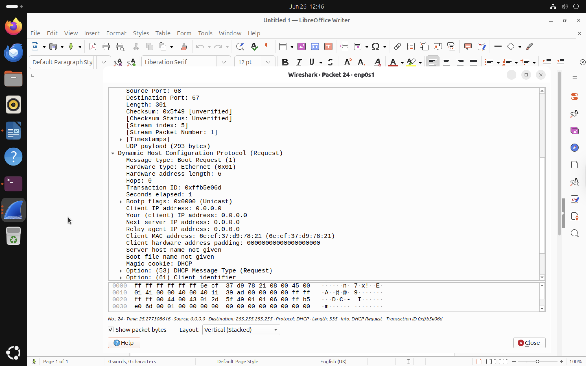
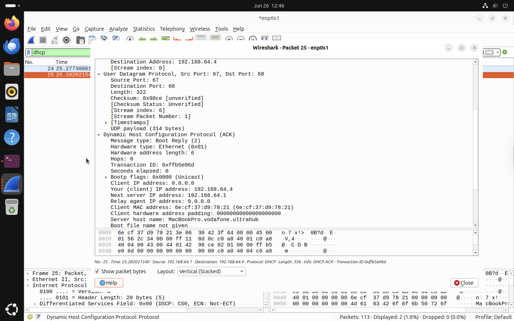

# Dynamic Host Configuration Protocol (DHCP) Analysis

This section investigates how Dynamic Host Configuration Protocol (DHCP) assigns and renews IP address leases within a virtualised Ubuntu environment. The packet capture was performed using Wireshark while restarting the network connection. The capture demonstrates a DHCP lease renewal where the client already possessed a valid IP address and requested permission to continue using it.

# Objectives

- Understand the purpose of DHCP
- Capture DHCP traffic using Wireshark
- Analyse DHCP Request and DHCP ACK messages
- Examine DHCP packet structure
- Understand DHCP lease renewal behaviour
- Compare lease renewal with the complete DORA process

# What is DHCP?

Dynamic Host Configuration Protocol (DHCP) automatically provides network configuration information to devices joining a network. Instead of manually configuring every computer with an IP address, subnet mask, default gateway and DNS server, a DHCP server performs this configuration automatically. Typical information assigned includes,

- IP Address
- Subnet Mask
- Default Gateway
- DNS Server
- Lease Time

DHCP uses the User Datagram Protocol (UDP).

| Client | Server |
|---------|---------|
| UDP Port 68 | UDP Port 67 |

# The DHCP DORA Process

When a device joins a network without an existing lease, DHCP normally follows a four step exchange commonly known as DORA.

| Step | Description |
|-------|-------------|
| Discover | Client broadcasts a request searching for DHCP servers |
| Offer | DHCP server offers an available IP address |
| Request | Client requests to use the offered address |
| ACK | DHCP server confirms the lease |

Flow:

Client

↓

Discover

↓

DHCP Server

↓

Offer

↓

Client

↓

Request

↓

DHCP Server

↓

Acknowledgement (ACK)

# Lab Environment

| Component | Value |
|------------|-------|
| Operating System | Ubuntu |
| Capture Tool | Wireshark |
| Interface | enp0s1 |
| DHCP Client Port | UDP 68 |
| DHCP Server Port | UDP 67 |

# Display Filter

```
dhcp
```

# Capture Results

The packet capture contains:

- DHCP Request
- DHCP ACK

Unlike the initial DORA process, no Discover or Offer packets were observed. This behaviour occurs because the virtual machine already possessed a valid DHCP lease. Instead of requesting a new IP address, the client requested permission to continue using the existing IP address. The DHCP server accepted the request by returning a DHCP ACK.

# DHCP Request Analysis

The DHCP Request packet was transmitted from the client to the DHCP server. The client broadcasts the request because network configuration has not yet been confirmed. Important fields observed:

| Field | Value |
|--------|-------|
| Source IP | 0.0.0.0 |
| Destination IP | 255.255.255.255 |
| UDP Source Port | 68 |
| UDP Destination Port | 67 |
| DHCP Message Type | Request |
| Transaction ID | 0xffb5e06d |
| Client MAC Address | Present |




## Packet Details

The DHCP Request packet contains several important fields. These fields uniquely identify the client requesting renewal of the DHCP lease.
- Boot Request
- Hardware Type (Ethernet)
- Client MAC Address
- Transaction ID
- DHCP Message Type: Request
- UDP Source Port 68
- UDP Destination Port 67



# DHCP ACK Analysis

The DHCP server responded with a DHCP ACK message confirming the client's lease. Important fields observed are following,

| Field | Value |
|--------|-------|
| Source IP | 192.168.64.1 |
| Destination IP | 192.168.64.4 |
| UDP Source Port | 67 |
| UDP Destination Port | 68 |
| DHCP Message Type | ACK |
| Assigned IP | 192.168.64.4 |

The DHCP ACK confirms that the client is permitted to continue using the assigned IP address.



# Lease Renewal vs Initial Address Assignment

A DHCP exchange can occur in two different ways.

## Initial Connection

```
Discover

↓

Offer

↓

Request

↓

ACK
```

Used when a client has no valid IP address.


## Lease Renewal

```
Request

↓

ACK
```

Used when the client already has a valid lease.

The capture in this project represents the second scenario.

# Observations

The following behaviours were observed:

- Client broadcasted a DHCP Request.
- DHCP server responded immediately with DHCP ACK.
- Existing IP address was retained.
- UDP ports 67 and 68 were used.
- Communication completed successfully.


# Key Findings

This experiment demonstrates how DHCP manages IP address leases within a virtualised network. Although the complete DORA exchange was not captured the observed Request and ACK messages accurately represent the DHCP lease renewal process commonly encountered in real world enterprise environments. Understanding both the initial DORA exchange and lease renewal process is essential when analysing DHCP traffic during network troubleshooting and incident response.

# Skills Demonstrated

- Wireshark packet analysis
- DHCP protocol analysis
- UDP communication
- DHCP lease renewal
- Network troubleshooting
- Packet inspection
- Virtual network analysis
