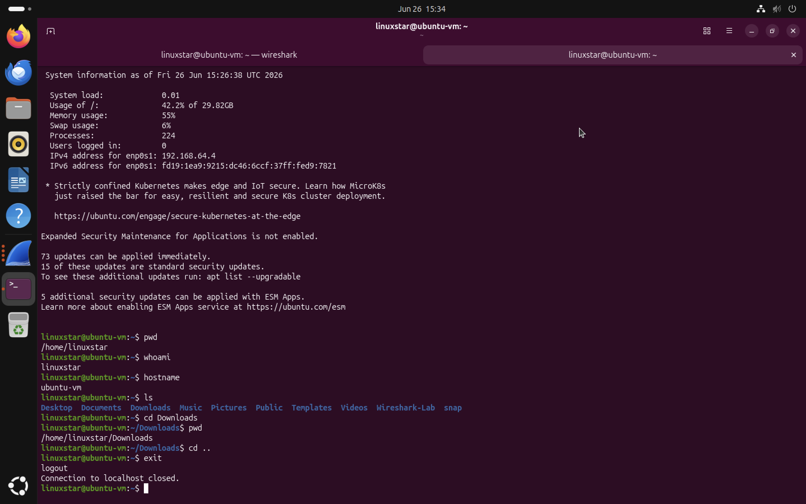
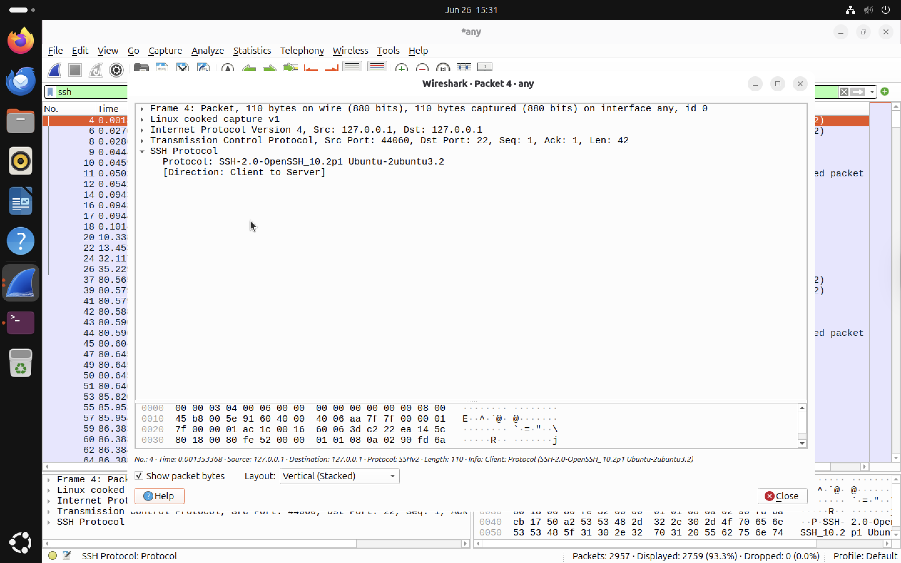
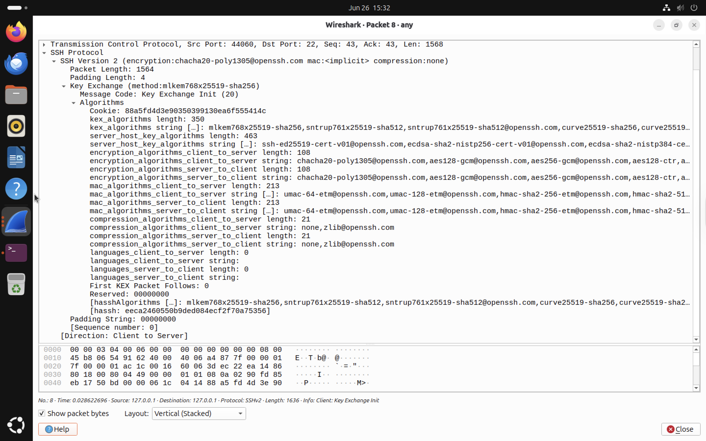
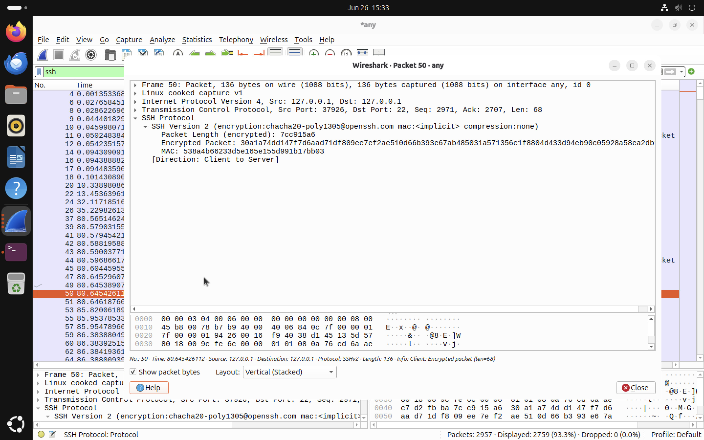

# SSH Analysis

## Overview

This chapter investigates the behaviour of the SSH protocol using Wireshark. It is the industry standard protocol for secure remote administration and encrypted communication between systems. Unlike FTP, which transmits usernames, passwords and commands in plaintext, SSH encrypts the entire communication session after the initial handshake and key exchange. The objective of this analysis is to observe the SSH connection establishment process, examine the protocol negotiation and cryptographic key exchange and demonstrate why encrypted protocols provide significantly stronger security than legacy protocols.

An SSH session follows the sequence below:
Client
   │
   │ TCP Three-Way Handshake
   ▼
Server

↓

Protocol Version Exchange

↓

Key Exchange Negotiation

↓

Server Authentication

↓

Session Key Generation

↓

Encrypted Communication Begins

↓

Secure Command Execution
After the key exchange completes, all traffic is encrypted using negotiated cryptographic algorithms.

## Lab Environment

| Component | Details |
|-----------|---------|
| Host | macOS |
| Guest OS | Ubuntu |
| Tool | Wireshark |
| Interface | any |


## Generating SSH Traffic

Wireshark was started using the display filter:

```text
ssh
```

An SSH connection was then established to the local Ubuntu machine.

```bash
ssh linuxstar@localhost
```

After successful authentication, I executed several standard Linux commands to generate encrypted SSH traffic.

```bash
pwd
whoami
hostname
ls
cd Downloads
pwd
cd ..
exit
```

Unlike FTP, these commands were executed through an encrypted communication channel.
The screenshot below shows the SSH session used to generate the captured traffic.




# Packet Analysis

## 1. Protocol Negotiation

The first packets exchanged between the client and server contain the SSH protocol version. This confirms that both systems successfully negotiated an SSH Version 2 connection before secure communication began.




## 2. Cryptographic Key Exchange

After negotiating the protocol version, SSH performs a cryptographic key exchange. During this phase, the client and server securely negotiate encryption algorithms and establish shared session keys that will protect all subsequent communication. This process occurs before any authentication credentials or user commands are transmitted.




## 3. Encrypted Communication

Once the key exchange completed successfully, all remaining communication became encrypted. Although Wireshark could still recognise the packets as SSH traffic, the packet contents could no longer be inspected. The username, password, executed commands and returned output were protected by encryption.




# Security Observations

Unlike FTP, SSH does not transmit sensitive information in plaintext. During packet analysis, Wireshark successfully identified:

* SSH protocol negotiation
* Cryptographic key exchange
* Encrypted packet exchange

However, Wireshark could **not** reveal:

* User password
* Executed commands
* Command output
* Directory listings
* Session contents

This demonstrates why SSH is the preferred protocol for secure remote administration.


# Comparison with FTP

| Feature            | FTP       | SSH       |
| ------------------ | --------- | --------- |
| Authentication     | Plaintext | Encrypted |
| Commands           | Plaintext | Encrypted |
| Directory listings | Visible   | Encrypted |
| Packet contents    | Readable  | Encrypted |
| Default Port       | TCP 21    | TCP 22    |

# Key Findings

* Successfully established an SSH Version 2 session.
* Observed the SSH protocol negotiation process.
* Captured the cryptographic key exchange.
* Verified that all subsequent communication was encrypted.
* Confirmed that Wireshark could identify SSH traffic but could not inspect its encrypted payload.
* Demonstrated the security advantages of SSH over FTP for remote system administration.
