# Network Troubleshooting

# Investigation 1 : Local DNS Resolver Failure

### Objective

The objective of this investigation was to troubleshoot a DNS resolution failure using Wireshark. A fault was intentionally introduced by disabling the local DNS resolver service, allowing the resulting network behaviour to be analysed.

## Generating the Failure

Packet capture was started in Wireshark. To simulate a DNS failure, the local resolver configuration was modified and the DNS resolver service was stopped.

```bash
sudo nano /etc/resolv.conf
```

The configured nameserver was changed to an unreachable address.

```text
nameserver 10.10.10.10
```

The resolver service was then stopped.

```bash
sudo systemctl stop systemd-resolved
```

Finally, a DNS lookup was attempted.

```bash
ping google.com
```

The operating system returned the following error.

```text
ping: google.com: Temporary failure in name resolution
```

This confirms that hostname resolution failed before any connection to Google's servers could be established.

**Terminal Output**

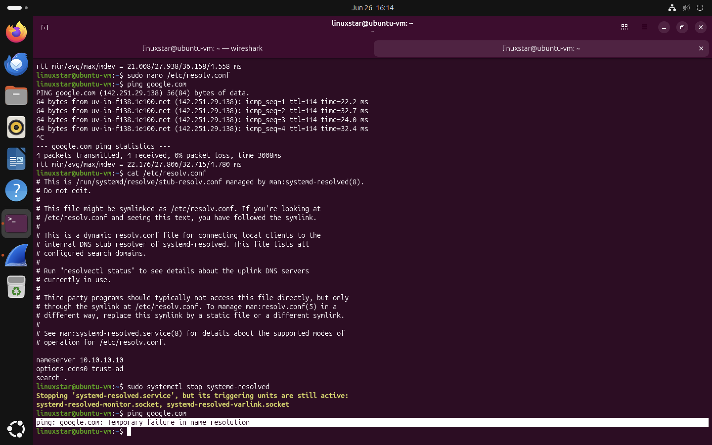


# Packet Analysis

## DNS Query

Wireshark captured the outgoing DNS query requesting the IPv4 address (A record) for **google.com**. The packet shows following information,
* Source IP address
* Destination UDP port 53
* Transaction ID
* Standard DNS Query
* Query Type A (IPv4)

Although the request was generated successfully, the hostname could not be resolved because the local DNS resolver was unavailable.

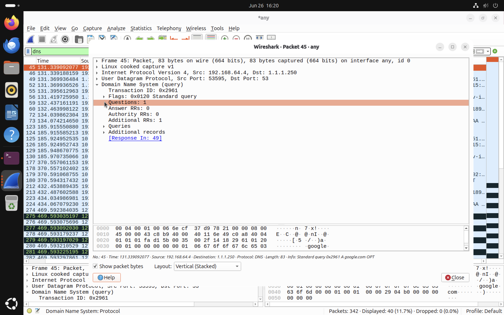


## Local Resolver Failure

Instead of receiving a normal DNS response, Wireshark captured an **ICMP Destination Unreachable (Port Unreachable)** message. The packet reveals that,
* ICMP Type: Destination Unreachable (3)
* Code: Port Unreachable (3)
* Original DNS query encapsulated within the ICMP packet

This indicates that the local DNS stub resolver (**127.0.0.53**) was no longer listening on UDP port 53 after the resolver service had been stopped. Rather than forwarding the request to an upstream DNS server, the operating system immediately rejected the packet.

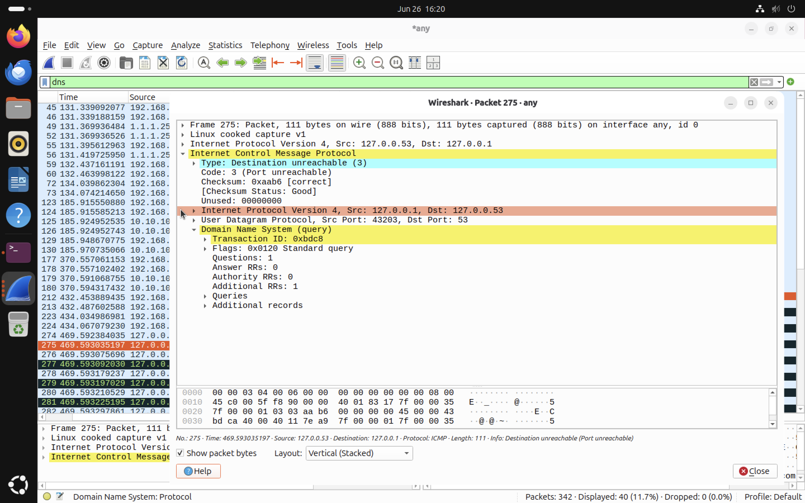

## Root Cause Analysis

The DNS failure was caused by disabling the local DNS resolver service. Without an active resolver listening on UDP port 53, every DNS lookup generated an ICMP **Destination Unreachable (Port Unreachable)** message. Because the hostname could not be translated into an IP address, the application was unable to establish communication with the requested host.


## Troubleshooting Summary

| Observation  | Finding                                                                          |
| ------------ | -------------------------------------------------------------------------------- |
| User symptom | `Temporary failure in name resolution`                                           |
| DNS Query    | Successfully generated                                                           |
| DNS Response | Not received                                                                     |
| ICMP Message | Destination Unreachable (Port Unreachable)                                       |
| Root Cause   | Local DNS resolver unavailable                                                   |
| Resolution   | Restart the `systemd-resolved` service and restore the correct DNS configuration |

## Key Findings

* Successfully simulated a DNS resolution failure.
* Captured the DNS request generated by the client.
* Observed an ICMP **Destination Unreachable (Port Unreachable)** response instead of a DNS reply.
* Determined that the failure occurred because the local DNS resolver service was unavailable.
* Demonstrated how Wireshark can be used to identify the root cause of hostname resolution failures.

# Investigation 2 : Connection Refused (TCP Reset)

## Objective

This investigation demonstrates how Wireshark can be used to diagnose a TCP connection failure caused by **attempting to connect to a closed port.** The objective was to understand how TCP behaves when a client requests a service that is not running and how this behaviour appears within a packet capture.

## What is a TCP Reset (RST)?

TCP uses a **Reset (RST)** flag to immediately terminate or reject a connection. Unlike a normal TCP connection, which is established using the Three Way Handshake (SYN → SYN-ACK → ACK), a TCP Reset indicates that the requested connection cannot be established.
A TCP RST is typically sent when:
- No application is listening on the requested port.
- A service has unexpectedly closed the connection.
- The operating system rejects the incoming connection.
- A firewall or security device actively refuses the connection.

In this investigation, no service was listening on **TCP port 8080**, so the operating system immediately rejected the connection by returning a TCP Reset (RST) packet.

## Practical Demonstration

To verify that no application was listening on TCP port **8080**, the currently listening ports were first inspected using:

```bash
ss -tuln
```

The output confirmed that port **8080** was not present in the list of active services.

An attempt was then made to establish a TCP connection using:

```bash
telnet localhost 8080
```

The connection immediately failed with the message:

```text
Unable to connect to remote host: Connection refused
```

The screenshot below shows the listening services together with the failed connection attempt.

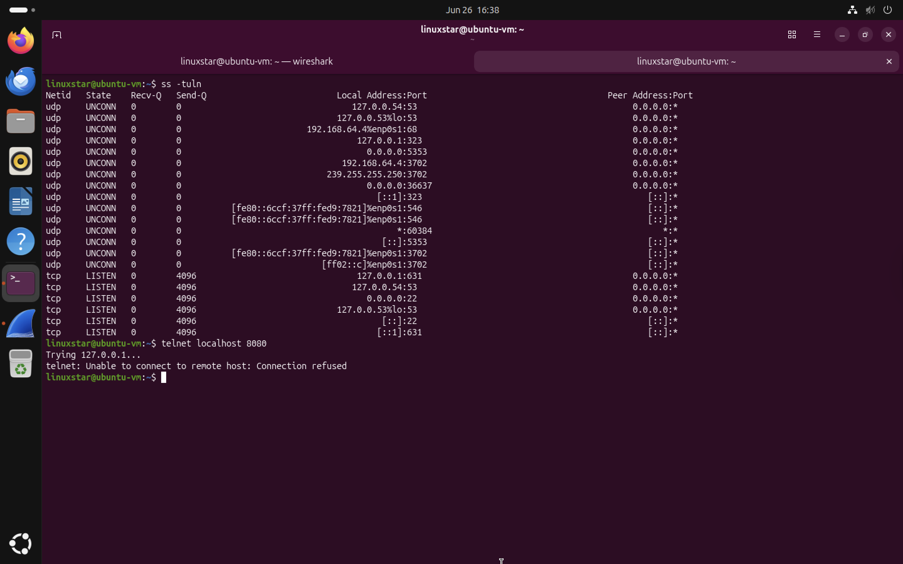


## Packet Capture Analysis

After starting packet capture in Wireshark, the failed connection attempt generated only two TCP packets.

```
Client                    Server

SYN  -------------------->

      <------------------  RST, ACK
```

Unlike a successful TCP connection, the server never replied with a **SYN-ACK** because no application was listening on the requested port. Instead, the operating system immediately responded with a **Reset (RST)** packet, informing the client that the requested service was unavailable.

The capture clearly shows the client sending a TCP SYN packet followed immediately by a TCP Reset (RST, ACK) response.

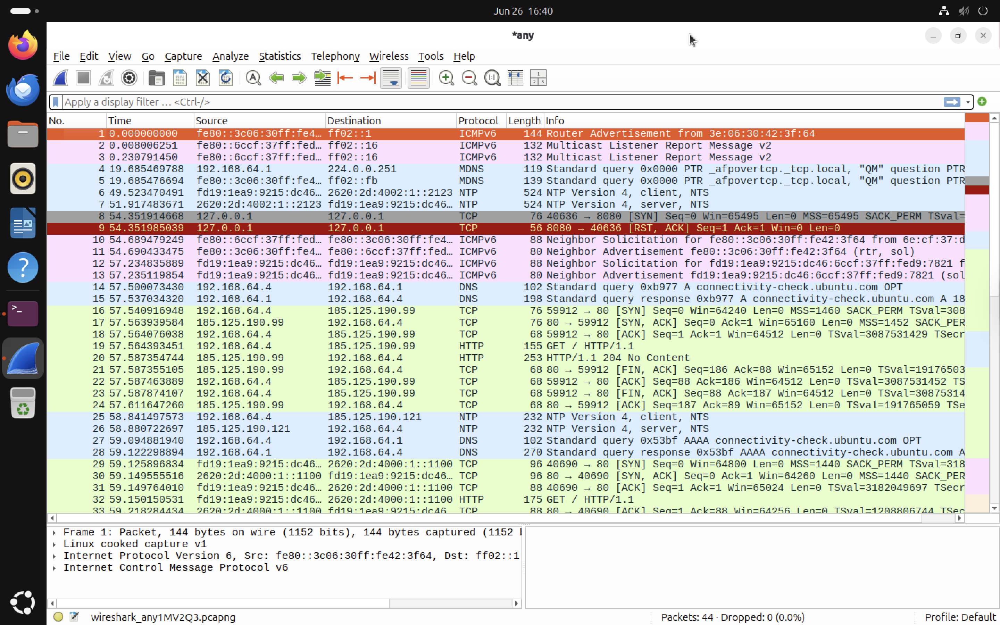


## TCP Flag Analysis

Inspecting the returned packet reveals the TCP Flags field.

```
Flags: 0x014 (RST, ACK)

Acknowledgment: Set
Reset: Set
```

The **Reset (RST)** flag is the key indicator that the operating system actively rejected the connection request rather than silently ignoring it. The **Acknowledgment (ACK)** flag confirms that the server received the client's SYN packet before terminating the connection.

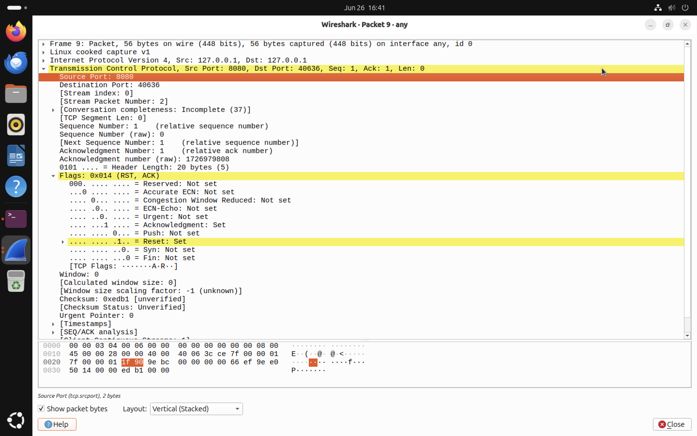


## Root Cause Analysis

The packet capture shows that:

- The client successfully reached the destination host.
- The destination host received the SYN packet.
- No service was listening on TCP port **8080**.
- The operating system immediately generated a TCP Reset (RST) packet.
- The connection was actively refused rather than timing out.

This behaviour confirms that the network itself was functioning correctly and that the problem existed at the application layer because the requested service was unavailable.


## Connection Refused vs Timeout

| Connection Refused (RST) | Connection Timeout |
|---------------------------|--------------------|
| Host is reachable | Host may be unreachable |
| TCP Reset (RST) returned | No response received |
| Service is not listening | Packets are dropped or filtered |
| Immediate failure | Connection eventually times out |

## Key Findings

- Successfully generated a TCP connection refused scenario.
- Observed a TCP SYN packet followed immediately by a TCP Reset (RST).
- Identified the TCP Reset flag in Wireshark.
- Distinguished between a refused connection and a successful TCP handshake.
- Demonstrated how Wireshark can be used to diagnose unavailable network services.

## Skills Demonstrated

- Network troubleshooting using Wireshark.
- TCP packet analysis.
- TCP Reset (RST) identification.
- Understanding failed TCP connection establishment.
- Correlating terminal output with packet capture evidence.

# Investigation 3 – Measuring Network Latency with ICMP

## Objective

This investigation demonstrates how Wireshark can be used to measure **network latency** by analysing ICMP Echo Requests and Echo Replies generated using the Linux `ping` utility.
Unlike previous investigations that focused on failures, this investigation examines normal network performance by measuring the **Round-Trip Time (RTT)** between the local Ubuntu virtual machine and an external host.

## What is Network Latency?

Network latency is the **time required for data to travel from one device to another and back again.** For ICMP traffic, this value is called the **Round-Trip Time (RTT)**.
Latency is one of the most important network performance metrics because even a healthy network with no packet loss may still feel slow if latency is high.
Typical causes of high latency include:

- Network congestion
- Long routing paths
- Wi-Fi interference
- VPN overhead
- Busy servers
- ISP routing issues

## Generating ICMP Traffic

Wireshark was started before generating network traffic.

The following command was executed:

```bash
ping google.com
```


### Analysing the Packet Capture

The following display filter was applied in Wireshark:

```text
icmp
```

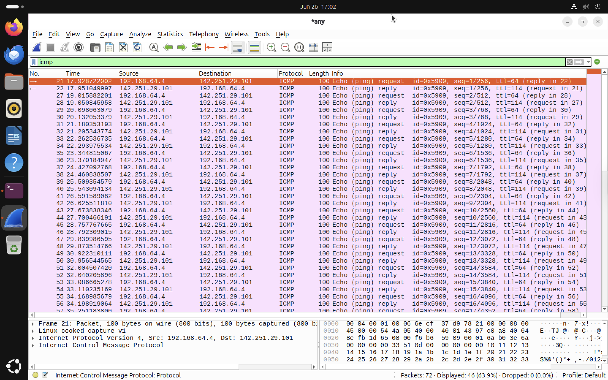

Each Echo Request generated a matching Echo Reply, allowing Wireshark to calculate the response time between the two packets.

### Echo Request Analysis

Selecting an ICMP Echo Request reveals several important fields.

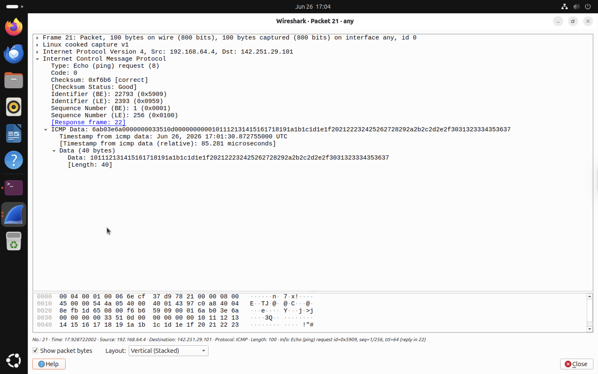

The packet contains:

- Source IP address
- Destination IP address
- ICMP Identifier
- Sequence Number
- Timestamp
- Payload data

The Identifier and Sequence Number uniquely identify each request so that the reply can be matched correctly.


### Echo Reply Analysis

The corresponding Echo Reply confirms that the destination host successfully responded.

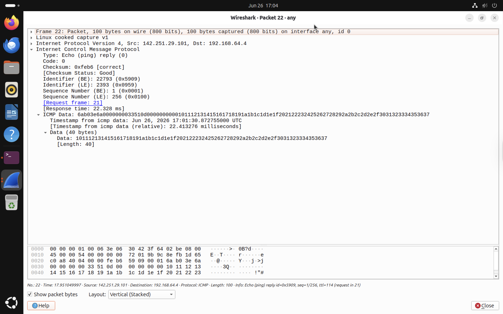

The reply contains the same:
- Identifier
- Sequence Number
- Payload

Wireshark also calculates the **response time between the request and reply.** In this lab the measured response time was approximately **22 ms**, which closely matches the latency reported by the Linux `ping` command.

## Findings

This investigation demonstrates how Wireshark can be used to measure network performance using ICMP traffic. The packet capture confirmed that:
- Every Echo Request received a matching Echo Reply.
- No packets were lost.
- Response times remained between approximately **22–36 ms**.
- The network connection was stable and responsive.

## Key Learning

ICMP is widely used during network troubleshooting because it provides valuable information about connectivity and performance. By analysing Echo Requests and Echo Replies, network analysts can determine:
- Host availability
- Round-Trip Time (RTT)
- Network latency
- Packet loss
- Overall network responsiveness
Wireshark makes it possible to visualise these exchanges and verify the latency measurements reported by diagnostic tools such as `ping`.

# Investigation 4 – HTTP 404 Not Found

## Objective

The objective of this investigation is to analyse how an HTTP **404 Not Found** error appears in Wireshark and understand the communication between a client and web server when a requested resource does not exist.

## What is HTTP 404?

An HTTP **404 Not Found** response indicates that the web server successfully received the client's request but could not locate the requested resource. Unlike connection failures, a **404 response confirms that the application layer is functioning correctly** but the requested content is unavailable.

This means:
- The web server is reachable.
- The TCP connection is successful.
- The HTTP request is valid.
- The requested file or webpage does not exist.

## Lab Setup

A temporary Python HTTP server was started on port **8080** using:

```bash
cd ~/Downloads
python3 -m http.server 8080
```

The server began listening for HTTP requests.

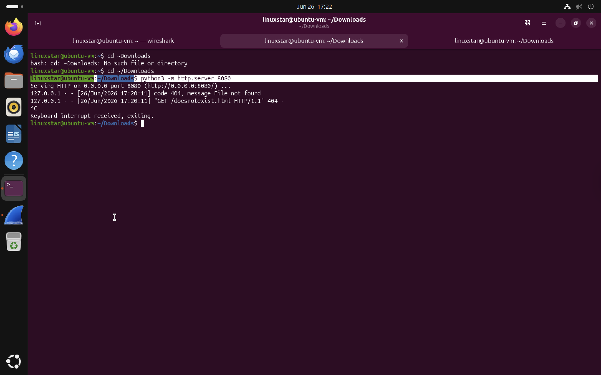


## Generating the 404 Error

A request was intentionally made for a webpage that does not exist.

```bash
curl http://localhost:8080/doesnotexist.html
```
The server returned an HTTP 404 error page.

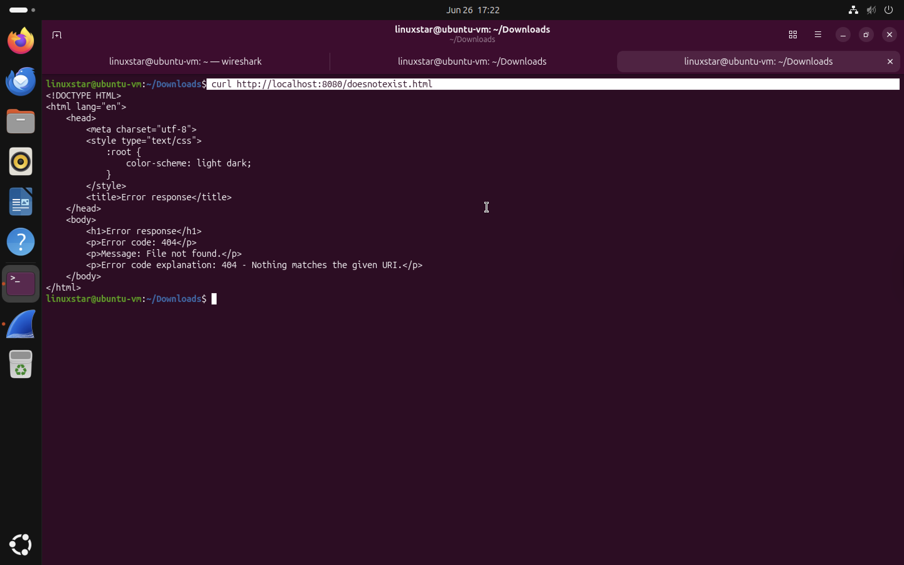

## Capturing the Traffic

While the request was being made Wireshark captured the complete HTTP conversation. he packet sequence shows,
1. TCP connection established
2. HTTP GET request
3. HTTP 404 response
4. TCP connection closed

Notice the highlighted packet:

```
GET /doesnotexist.html HTTP/1.1

↓

HTTP/1.0 404 File not found
```

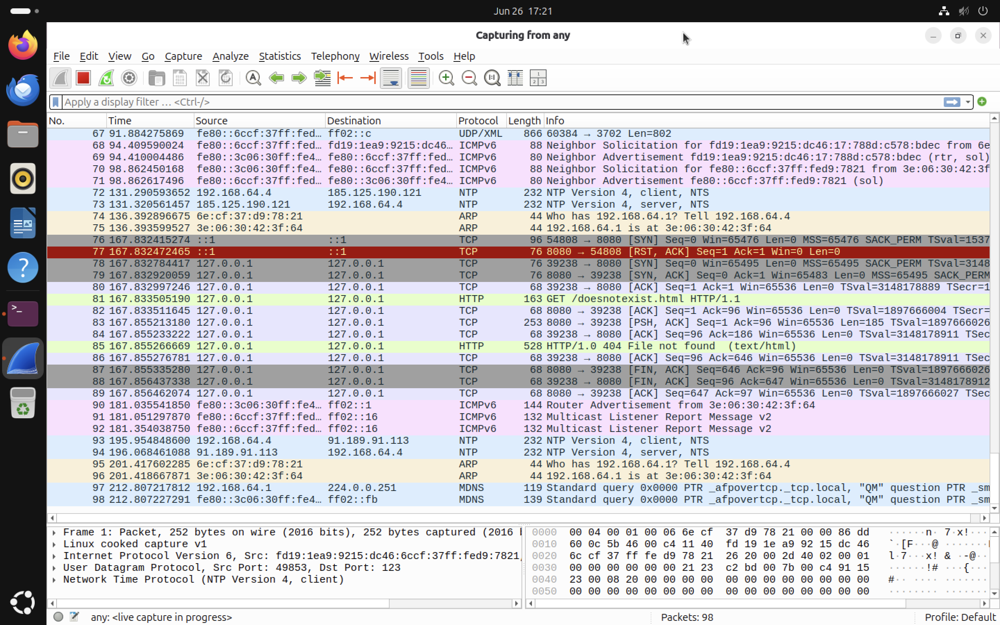

# Inspecting the HTTP Response

Opening the HTTP response packet reveals the complete HTTP status information. Important fields include following,
- Status Code: **404**
- Status Description: **Not Found**
- Reason Phrase: **File not found**
- Requested URI:
  ```
  /doesnotexist.html
  ```
- Full Request URI:
  ```
  http://localhost:8080/doesnotexist.html
  ```

Wireshark also reconstructs the HTTP response body generated by the Python web server.

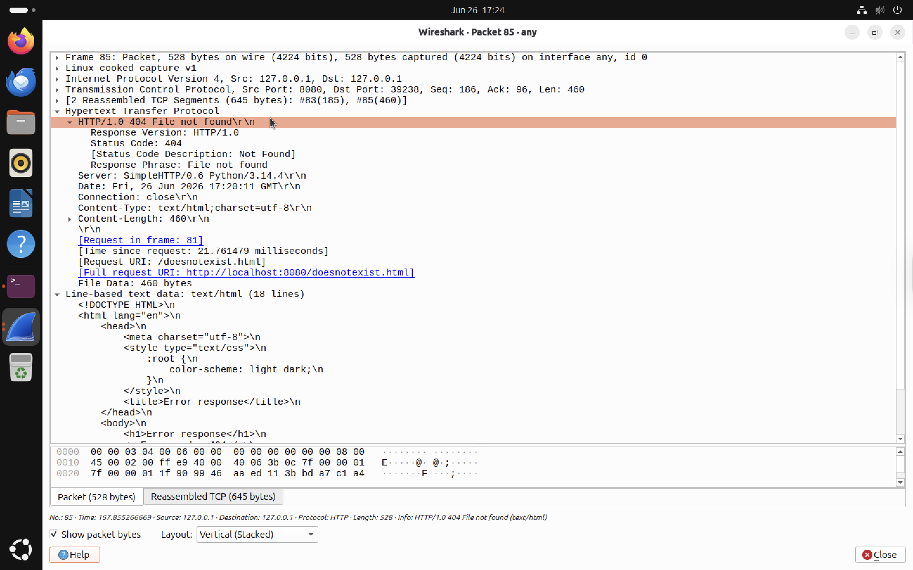


# Analysis

This investigation demonstrates that the network itself was functioning correctly. The client successfully resolved the destination, established a TCP connection and sent an HTTP GET request. The server successfully received, process the request and returned a valid HTTP response. The failure occurred only because the requested resource did not exist on the server. his illustrates an important troubleshooting concept that "A **404 Not Found** error is an **application layer** issue rather than a network connectivity issue."


# Wireshark Indicators

The following indicators can be used to identify HTTP 404 errors during packet analysis:
- Successful TCP three-way handshake
- HTTP GET request
- HTTP Status Code **404**
- Reason Phrase **File not found**
- Normal TCP connection termination


# Key Takeaways

- A TCP connection can succeed even when the requested webpage does not exist.
- HTTP status codes provide application-level troubleshooting information.
- Wireshark can reconstruct both HTTP requests and HTTP responses.
- A 404 response confirms that communication between the client and server is working correctly.
- Application errors should not be confused with network failures.
